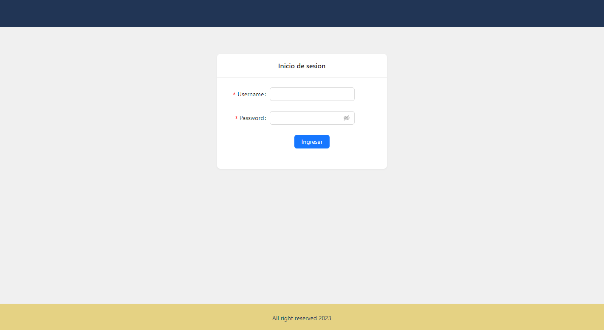

# TABLE APP DINAMIC

Aplicacion de react con login de usuario y obtencion de usuarios desde dummyJSON



Tecnologias:
- [React](https://es.react.dev/)
- [Ant Design](https://ant.design/components/overview/)
- [React Query](https://tanstack.com/query/v3/docs/react/overview)
- [DummyJSON](https://dummyjson.com/)

Instalacion:
```shell
git clone https://github.com/diegoalbert27/table-app-dinamic.git
```

```shell
npm i && npm run dev
```

Hecho con ❤️ y Javascript
